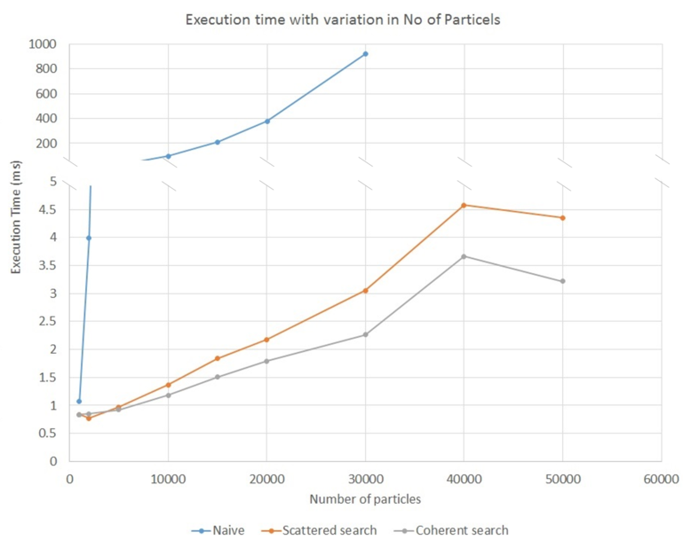
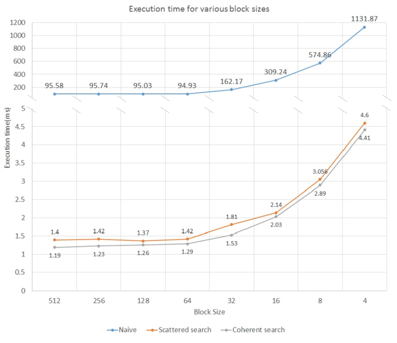

**University of Pennsylvania, CIS 565: GPU Programming and Architecture**
Project 1 - Flocking
====================

* Nischal K N
* Tested on: Windows 10, i7-2670QM @ 2.20GHz 8GB, GTX 540 2GB (Personal)

### SUMMARY

This projects implements a flocking simulation based on the [Reynolds Boids algorithm](http://www.red3d.com/cwr/boids/) on a GPU using CUDA and OpenGL. It includes two levels of optimization using a uniform grid and a uniform grid with semi-coherent memory access. Profiling results for various levels of implementation are included in this README.

### OUTPUT

Sample output of uniform grid with semi-coherent memory access with 5000 particles.

### SETUP and COMPILING

* To setup cuda development enivrnoment use [this guide](https://github.com/nischalkn/Project0-CUDA-Getting-Started/blob/master/INSTRUCTION.md#part-1-setting-up-your-development-environment)
* Once the envirnoment is set up, to Build and run the project follow [this](https://github.com/nischalkn/Project0-CUDA-Getting-Started/blob/master/INSTRUCTION.md#part-3-build--run)

### PARAMETERS
* `VISUALIZE` - `1` or `0`, Turn graphical output on/off
* `UNIFORM_GRID` - `1` or `0`, Turn on/off uniform grid with scattered search optimization
* `COHERENT_GRID` - `1` or `0`, Turn on/off uniform grid with coherent search optimization
* `N_FOR_VIS` - No of boids/particles
* `maxSpeed` - Max speed of particles
* `blockSize` - Number of threds per block
* boid motion parameters

| Rule			| Distance	| Scale		|
|:-------------:|:---------:|:---------:|
| Cohesion 		| 5.0f 		| 0.01f 	|
| Separation	| 3.0f 		| 0.1f 		|
| Alignment 	| 5.0f 		| 0.1f 		|

### PERFORMANCE ANALYSIS
Performance of the implementation was measured in terms of time taken for computation using cuda event timers under different particle count and block size.

The graph shows the average time to compute for different number of particles in different versions of optimization. The time taken for 5,000 steps were recorded in each case and the average was calculated. As the number of particles increase the time taken to compute the positions and velocities increase exponentially as the number of particles affecting each particle also increases. This exponential increase is very prominent in case of Naive implementation and less in case of optimized search. From the graph it can also be seen that the scattered search performs faster than coherent search for particles less than 2000. But as the number of particles increase, the coherent search has a better performance than scattered search. It is only at high particle count, the sequential memory access overcomes the additional work of rearranging the velocity and position vectors.

The second analysis was done on the performace of the different optimizations on different block sizes. A constant particle count of 10000 was used in all cases. The average time taken to execute 5000 steps were recorded in each case. It is seen that large block sizes have faster computation time. Bad performance at small block sizes can be attributed to the lack of caching ability of GPU. The smaller block size causes constant switching of memory context resulting in a lot of memory transfer, blocking threads and increasing the execution time. Also increasing the block size further would result in a slight increase in execution time as some clock cycles are wasted to retire dead blocks and free sufficient blocks needed.

