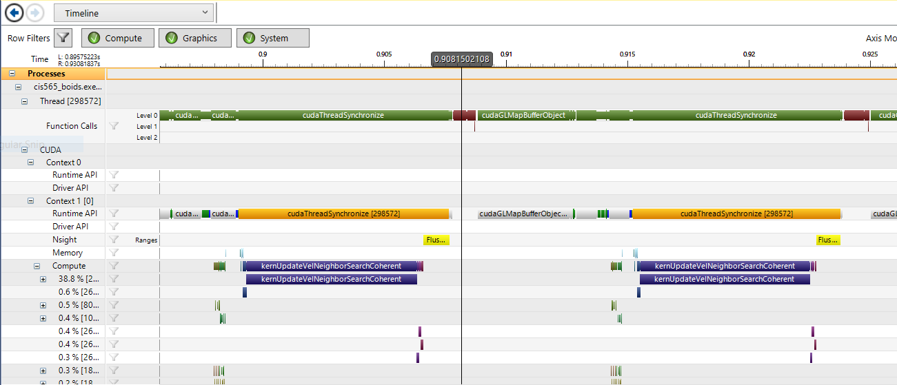

# University of Pennsylvania, CIS 565: GPU Programming and Architecture

## Project 1 - Flocking
* Liang Peng
* Tested on: Windows 10, i7-6700HQ @ 2.6GHz, 8GB, GTX 960M (Personal Computer)

## Screenshots
* Rendering
 
* Profiling
 

## Performance Analysis

### With Visualization

Algorithm | Max Boid Count | Framerate (FPS)
:---:|:---:|:---:
Brute-Force | 5,000 | 60
Scattered Uniform Grid | 55,000 | 60
Coherent Uniform Grid | 120,000 | 60

### Without Visualization

Algorithm | Boid Count | Framerate (FPS)
:---:|:---:|:---:
Brute-Force | 5,000 | 72
Scattered Uniform Grid | 5,000 | 590
Coherent Uniform Grid | 5,000 | 640

### Block Size

Boid Count | Block Size | Framerate (FPS)
:---:|:---:|:---:
50000 | 16 | 109
50000 | 32 | 170
50000 | 64 | 182
50000 | 128 | 180
50000 | 256 | 170
50000 | 1024 | 170

### Conclusion
* When boid count is small, framerate can be maintained at 60 fps. As  boid count increases, framerate will from some point drop below 60 fps.

* Algorithm used to update boid positions and velocities has large influence on simulation performance.
  * From 1.2 to 2.1, neighbor search efficiency is greatly improved by using grid index information.
  * From 2.1 to 2.3, performance is further improved because cache-hit rate is enhanced by grouping data accessed by neighboring threads.

*  Block size and block count has some impact on performance. As block size increases and block count decreases, framerate will rise and at some point drop.
	* _My speculation_ If block size is too small, block count will be large. Since each block is processed by a core and number of core is limited, number of cycles to handle all blocks will increase. If block size is too big, since capacity of cache in that block shared by its threads is limited, replacement of data in cache will become more frequent and decrease cache-hit rate thus affect performance.
