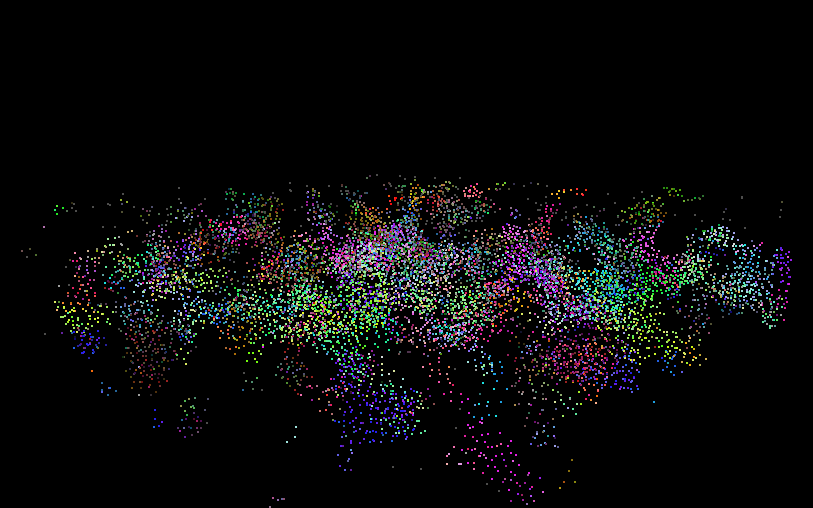
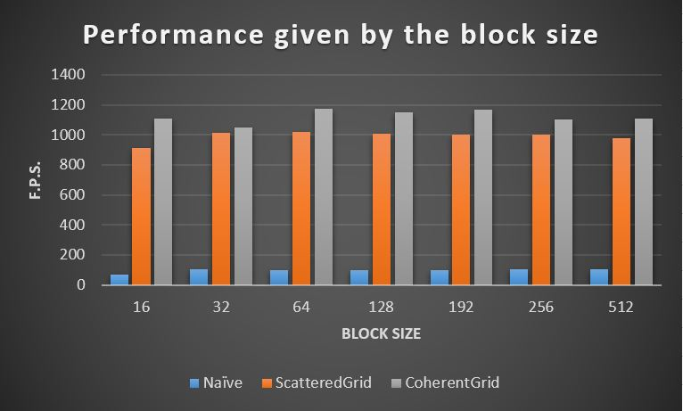

# University of Pennsylvania, CIS 565: GPU Programming and Architecture.
Project 1 CUDA: Flocking
====================

## User resources
- **Name:** David Grosman.
- **Tested on:** Microsoft Windows 7 Professional, i7-5600U @ 2.6GHz, 256GB, GeForce 840M (Personal laptop).

## Project description
This Project's purpose was to gain some experience writing simple CUDA kernels, using them, and analyzing their performance.
I implemented a flocking simulation based on the Reynolds Boids algorithm, along with two optimizations: a uniform grid and
a uniform grid with semi-coherent memory access.

## Screenshots of the Final Solution

---
### Performance Analysis

In the Boids flocking simulation, particles representing birds or fish (boids) move around the simulation space according to three rules:
cohesion - boids move towards the perceived center of mass of their neighbors
separation - boids avoid getting to close to their neighbors
alignment - boids generally try to move with the same direction and speed as their neighbors.

To satisfy these 3 rules, we need to check every two boids against each other which is very inefficient, especially if the number of boids is large and the neighborhood distance is much smaller than the full simulation space.
We can cull a lot of neighbor checks using a datastructure called a uniform spatial grid which is our first optimization (ie.: Scattered Grid).
Since a GPU is very efficient at multi-threading we re-organized our data into arrays which can be independantly accesed to perform parallel work. As such, we assign each Boid to a grid cell index, and perform work on each cell separately.
However, even though pointers to boids in a single cell are contiguous in memory, the boid data itself (velocities and positions) is scattered all over the place. In our second optimization (coherent grid), we rearrange the boid data itself
so that all the velocities and positions of boids in one cell are also contiguous in memory. We therefore are more space-coherent which is usually faster to acess data.

Note that the following statistics have been capture by averaging the FPS for the first 30 seconds of the simulation with the default parameters given when starting the project (unless otherwise specified).

* **How the Boids number affect performance**:

As expected, the performance of the Naive implementation is always slower than the two other implementations. Also, as the number of boids increases, the performance of the Naive
implementation decreases much faster than for the two other implementations. The coherent grid performance decreases the least since it is the most optimized for a large number
of boids. An interesting case is with 15000 boids where we might imagine that the optimization brought by the coherent grid is acting adversely because we use the rearranged
array index buffer to reshuffle all the particle data in the simulation array.

* **How the Block size affect performance**:

While the naive implementation is much slower than the scattered grid which is slightly slower than the coherent grid, their respective
variation of performance based on the block size is minimum. This indicates that the number of threads used does not constitute a bottleneck
but something else is. Either, we should optimize our division of parallel work performed or optimize the most time-consuming task itself.

* **Describe the performance improvements of the coherent uniform grid**:

In most cases, the coherent uniform grid is the most performant which I exepected since it contains the most number of optimizations. As noted above the case with 15000 boids is interesting since it contradicts all other results but is not significant since it is probably an outlier.

