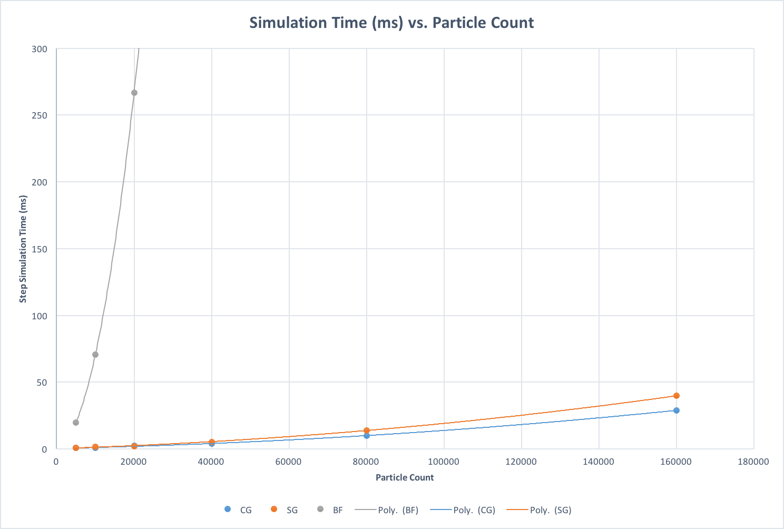
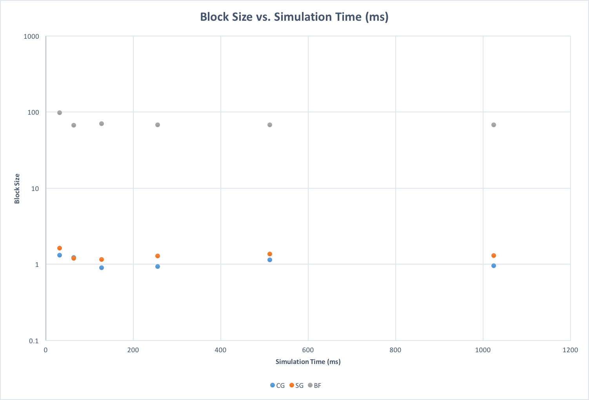

**University of Pennsylvania, CIS 565: GPU Programming and Architecture,
Project 1 - Flocking**

* Jian Ru
* Tested on: Windows 10, i7-4850 @ 2.30GHz 16GB, GT 750M 2GB (Personal)

---
### Results

* Parameters
  * Number of particles: 40,000
  * Blocks: 40, 1, 1
  * Threads: 128, 1, 1
  * Rule distances: 5.0, 3.0, 5.0
  * Rule scales: 0.01, 0.1, 0.1
  * Scene scale: 100.0
  * Delta time: 0.2
  

---
### Analysis

* Simulation Time vs. Number of Particles
  * For the brute force version, the simulation time grows polynomially as particle count increases. This is expected because
    even though the complexity of each thread is O(n) but there are too many particles and hence too many threads. So it is
    impossible to parallize all the threads at once. Therefore, the time complexity should still grow in a polynomial fashion
    but less sensitive than sequential implementation.
    

* Simulation Time vs. Block Size
  * The relationship between simulation time and block size is somewhat random but expected. Since it guaranteed that GPU
    executes each block on a single SM, putting more threads that access the same memory region with similar access pattern
    should increase performance due to the increased cache hit-rate. But putting too many threads in a single block may hinder
    performance if a SM cannot execute all the threads in a block at once.
    

* Coherent Grid vs. Scattered Grid
  * From my experimentation, coherent grid performances better than scattered grid. This is expected because even though
    reordering position and velocity arrays has cost, in this case, the gain from increased cache hit-rate outweight the cost
    of copying and additional kernel calls. Since adjacent threads tend to have shared neighouring cells, they tend to access
    the same memory regions when they execute. Even for just one thread, it also enjoys cache hit-rate increase because after
    sorting, the data of particles in the same cell are stored closely in one consecutive memory region.
