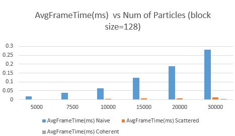
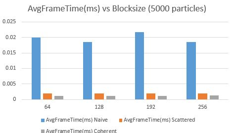
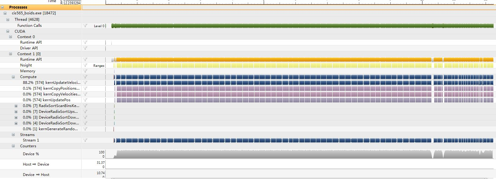
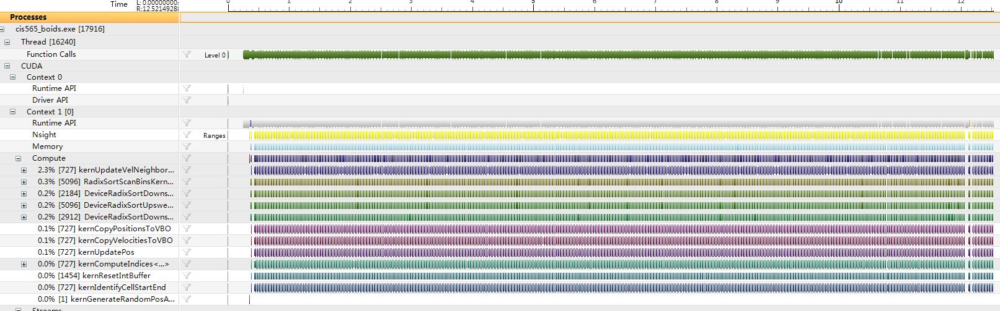
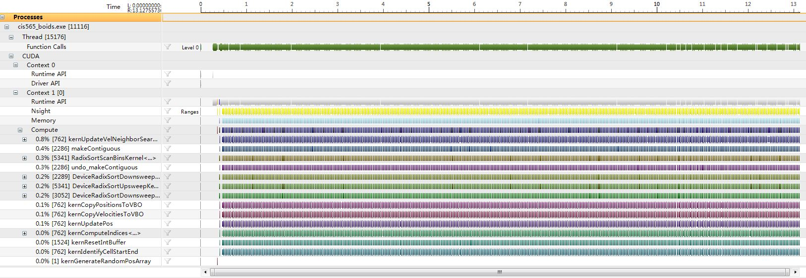

**University of Pennsylvania, CIS 565: GPU Programming and Architecture,
Project 1 - Flocking**

* Xiang Deng
* Tested on: Windows 7, i7-3610QM @ 2.3GHz 8GB, GTX 660M 1024MB 

### DEMO

* With 5000 particles:

* With 50000 particles:

### Performance Analysis
Note: The visualization has been disabled so that the performance analysis is based on the CUDA simulation only.
* Performance comparison with blocksize fixed (128).

|                        | 5000 particles | 7500 particles | 10000 particles | 15000 particles | 20000 particles |30000 particles|
|------------------------|----------------|-----------------|-----------------|------------------|------------------|------------------|
| Naive search (avg cuda time per frame (ms))           |    0.0185    |    0.0388    |    0.0633      |    0.122    |0.188 | 0.28|
| Scattered uniform grid (avg cuda time per frame (ms))  |    0.00192  |      0.00269 |     0.00355    |       0.0067     |0.00752 |0.0121 |
| Coherent uniform grid (avg cuda time per frame (ms))  |    0.00126  |   0.0014   |    0.00169   |    0.00232        |0.00278 | 0.00407|
* Performance comparison with particle number fixed (5000).

As expected, as the number of particles grows, the average cuda time each implementation increases. However the scatted uniform grid method
has achieved a significant speed up from naive search, while the coherent uniform grid method improves the speed up a lot more.
* Possible reasons explaining the speed up from naive search to scatter uniform grid (typically consider two major factors): 
1. in terms of searching, the complexity of single thread for naive search is O(N), where N is the number of particles; in comparison, the average complexity of scattered
 uniform grid is O(8/G*N), where G is the number of grids. Theoretically increasing G contributes to a reduced complexity of searching. 2. However, the sorting involved in the scatted uniform
grid should add on to the complexity, the typical complexity of the thrust-sort-by-key implementation for sequential frame update is currently unknown. 
* Why does coherent uniform grid significantly improve the performance of scattered uniform grid? We reshuffled the boid data such that the velocities and positions of 
boids in each cell are contiguous in memory, in this way we have direct access to the vel/pos data without memory accessing to the intermediate buffer. Since GPU has very limited amount
of cache for each thread/ALU, fetching data via pointers causes frequent jumping around in memory which is quiet inefficient for GPU architecture.

|                        | Blocksize=64| Blocksize=128 | Blocksize=192| Blocksize=256 |  
|------------------------|----------------|-----------------|-----------------|------------------| 
| Naive search (avg cuda time per frame (ms))           |    0.02012    |    0.01861   |   0.02178     |  0.01863 |
| Scattered uniform grid (avg cuda time per frame (ms))  |    0.00197  |     0.0022 |     0.0022  | 0.00191  |
| Coherent uniform grid (avg cuda time per frame (ms))  |    0.00119  |   0.00115  |   0.00118   |    0.00125       | 

Changing the blocksize slightly influence the performance for the three implementations; the uniform grid methods are less sensitive to blocksize change. 
This is most likely due to that despite the change of the blocksize, no threads is dependent on/ waiting for other threads to finish.

 Three more plots showing the performance analysis (using Nsight) (5000 particles, 128 blocks)
* Performance analysis of Naive search

* Performance analysis of Scattered Uniform Grid

* Performance analysis of Coherent Uniform Grid

### Build
Please follow the instructions here: https://github.com/CIS565-Fall-2016/Project0-CUDA-Getting-Started/blob/master/INSTRUCTION.md

Note: CMakeLists.txt has been modified : 20ms --> 30ms