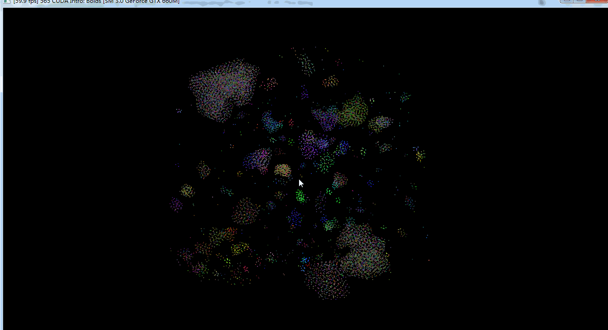

**University of Pennsylvania, CIS 565: GPU Programming and Architecture,
Project 1 - Flocking**

* Kaixiang Miao
* Tested on: Windows 7, i7-3630QM @ 2.40GHz 8GB, GTX 660M 2GB (Lenovo Y580 laptop, personal computer)

#### Screenshot

___

The `.gif` above shows my work of **Coherent Boids Flocking**. Parameters are listed as below:

* *N\_FOR_VIS* : `10000`
* *DT* : `0.2f` 
* *blockSize* : `128`
* *rule1Dsitance* : `5.0f`
* *rule2Distance* : `3.0f`
* *rule3Distance* : `5.0f`
* *rule1Scale* : `0.01f`
* *rule2Scale* : `0.1f`
* *rule3Scale* : `0.1f`
* *maxSpeed* : `1.0f`
* *scene_scale* : `100.0f`

#### Performance Analysis

___

