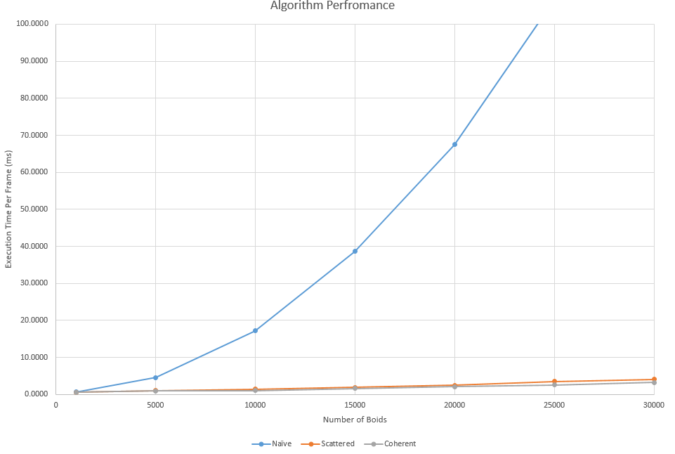
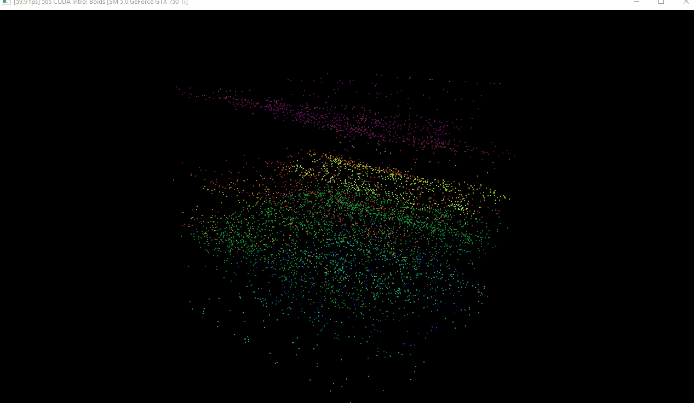

**University of Pennsylvania, CIS 565: GPU Programming and Architecture,
Project 1 - Flocking**

* Michael Willett
* Tested on: Windows 10, I5-4690k @ 3.50GHz 8.00GB, GTX 750-TI 2GB (Personal Computer)

## Contents
1. [Introduction](#intro)
2. [Naive Solution](#part1)
3. [Neighborhood Search](#part2)
4. [Performance Analysis](#part3)
5. [Development Process](#part4)
6. [Build Instructions](#appendix)

<a name="intro"/>
## Introduction: Flocking Simulation
This project explores introductory concepts of GPU paralization methods for simulating flocking behaviors
of simple particles known as boids. Boid motion is based off of three rules calculated from nearby particles:

1. *Cohesion* - Boids will move towards the center of mass of nearby boids
2. *Separation* - Boids will try to maintain a minimum distance from one another to avoid collision
3. *Alignment* - Boids in a group will try to align vector headings with those in the group

These simple rules with the appropriate tuning parameter set can lead to a surprisingly complex emergent 
behavior very similar to how schools of fish or flocks of birds move in nature, as seen below.

*Boid Flocking Simulation*

<a name="part1"/>
## Section 1: Naive Solution
The boids flocking simulation is naively calculated by comparing euclidean distance from the current
boid to every other boid in the simulation, and checking if the distance is within the desired range for
the rule being calculated (we use a smaller distance metric for calculating separation, otherwise the boids
never exhibit flocking behavior).

While computationally this results in the correct behavior, it can be wasteful in the number of comparison operations
since we only apply position and velocity updates if a boid has at least one other particle close to it. For smaller
particle counts, this method can achieve 60 fps on a cheap modern process, but scales very poorly as the number of 
comparisons increases. Detailed analysis is available in [Section 3: Performance Analysis](#part-3).

<a name="part2"/>
## Section 2: Neighborhood Search
To improve the performance on the naive solution, the physical volue can be descretized into a unform grid, with each
voxel index linking to a list of boids contained inside each cell. This approach include some additionaly computation
overhead to properly sort each boid into its correct bin, but limits the search for neighboring boids to only those 
contained in nearby cells. If the the descritization is set such that the cell edge size is twice the effective distance 
for velocity updates, the neighborhood search is limited to boids contained in at most eight cells.

In particular, this approach has two major additional steps, of which both are easily unwrapped into independent parallel
processes. The first step is to assign each boid to a cell, which is fortunately just a computation based off of its 
current position and the grid resolution, so overhead is minimal. 

The second major step is to sort all boids by their cell index, and compute a list of all boids within each cell. CUDA
fortunately provides a very fast unstable sort operation. Once the boids are sorted by cell index, all boids in each cell
can be sorted in parallel solely by identifing transitions between cells in the sorted array.

[Section 3: Performance Analysis](#part-3) outlines the significant performance improvements over the naive solution. It also
shows a small improvement by adding an additional overhead step to sort the position and velocity arrays directly, rather 
than doing an array lookup for each update step. This extra step will be refered to as a coherent array, while the unsorted
position/velocity implementation will be called the scattered array.

<a name="part3"/>
## Section 3: Performance Analysis
*All benchmarks were formed with a cohesion radius of 5 units, separation radius of 3 units, and alignment raidus of 5 units.
Performance was tested relative to the number of boids in a cube with edge length 100 units.*

Reducing the search space with a uniform grid shows significant improvements over the naive solution. Experiments show that
this implementation scales exponentially, as expected since complexity os O(n^2). The uniform grid implementation shows much 
better scaling as the number of boids increases, with the most significant improvement at 20,000 boids, which is the largest 
amount tested. The additional position/velocity sorting shows about 20% improvement in tests with significantly more boids 
than cells.

<a name="part4"/>
## Section 4: Development Process
Development of the coherent grid involved several development bugs. The first several implementation steps involved sorting
both the position and velocity arrays directly with replacement on the original array. This showed an interesting artifact
where the general boid flocking behavior was mostly intact in two dimensions, but boids seemed to align along the third 
(shown below).

*Failure From Overwiting initial Position/Velocity Arrays*

Originally I had determined that the cause was due to sorting the position and velocity frames prior to binning the boids
into their respective cells. Switching the order of these steps at first glance seems to solve the behavior. However, after
observing the behavior for longer time periods, all boids seem to develop the same uniform velocity regardless of their 
distance to neighboring flocks.

It was finally determined that the route cause was that in the kernel invocation, the boid being tested must come from the
unsorted array, while the boids the current index is being tested against must come from the sorted arrays. This final
implementation results in up to a 20% improvement depending on density of the boids in the simulation.

<a name="appendix"/>
## Appendix: Build Instructions

* `src/` contains the source code.
* `external/` contains the binaries and headers for GLEW and GLFW.

**CMake note:** Do not change any build settings or add any files to your
project directly (in Visual Studio, Nsight, etc.) Instead, edit the
`src/CMakeLists.txt` file. Any files you add must be added here. If you edit it,
just rebuild your VS/Nsight project to make it update itself.

#### Windows

1. In Git Bash, navigate to your cloned project directory.
2. Create a `build` directory: `mkdir build`
   * (This "out-of-source" build makes it easy to delete the `build` directory
     and try again if something goes wrong with the configuration.)
3. Navigate into that directory: `cd build`
4. Open the CMake GUI to configure the project:
   * `cmake-gui ..` or `"C:\Program Files (x86)\cmake\bin\cmake-gui.exe" ..`
     * Don't forget the `..` part!
   * Make sure that the "Source" directory is like
     `.../Project1-CUDA-Flocking`.
   * Click *Configure*.  Select your version of Visual Studio, Win64.
     (**NOTE:** you must use Win64, as we don't provide libraries for Win32.)
   * If you see an error like `CUDA_SDK_ROOT_DIR-NOTFOUND`,
     set `CUDA_SDK_ROOT_DIR` to your CUDA install path. This will be something
     like: `C:/Program Files/NVIDIA GPU Computing Toolkit/CUDA/v7.5`
   * Click *Generate*.
5. If generation was successful, there should now be a Visual Studio solution
   (`.sln`) file in the `build` directory that you just created. Open this.
   (from the command line: `explorer *.sln`)
6. Build. (Note that there are Debug and Release configuration options.)
7. Run. Make sure you run the `cis565_` target (not `ALL_BUILD`) by
   right-clicking it and selecting "Set as StartUp Project".
   * If you have switchable graphics (NVIDIA Optimus), you may need to force
     your program to run with only the NVIDIA card. In NVIDIA Control Panel,
     under "Manage 3D Settings," set "Multi-display/Mixed GPU acceleration"
     to "Single display performance mode".

#### OS X & Linux

It is recommended that you use Nsight.

1. Open Nsight. Set the workspace to the one *containing* your cloned repo.
2. *File->Import...->General->Existing Projects Into Workspace*.
   * Select the Project 0 repository as the *root directory*.
3. Select the *cis565-* project in the Project Explorer. From the *Project*
   menu, select *Build All*.
   * For later use, note that you can select various Debug and Release build
     configurations under *Project->Build Configurations->Set Active...*.
4. If you see an error like `CUDA_SDK_ROOT_DIR-NOTFOUND`:
   * In a terminal, navigate to the build directory, then run: `cmake-gui ..`
   * Set `CUDA_SDK_ROOT_DIR` to your CUDA install path.
     This will be something like: `/usr/local/cuda`
   * Click *Configure*, then *Generate*.
5. Right click and *Refresh* the project.
6. From the *Run* menu, *Run*. Select "Local C/C++ Application" and the
   `cis565_` binary.
