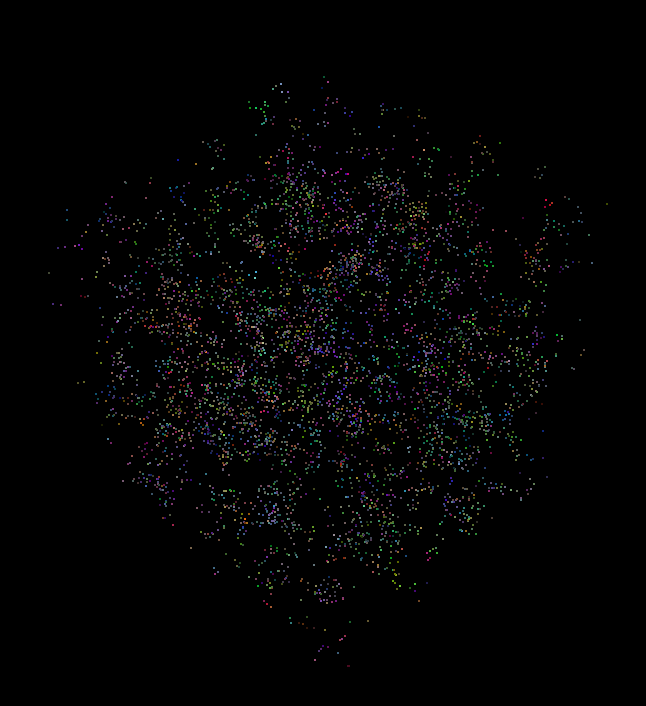

University of Pennsylvania, [CIS 565: GPU Programming and Architecture](http://www.seas.upenn.edu/~cis565/)

Implemented by [Gabriel Naghi](https://www.linkedin.com/in/gabriel-naghi-78ab4738) on Windows 7, i7-xxx @ xGHz xxGB, Quadro K620 2048MB (Moore 100C Lab)

Project 1 - Flocking
=====================

Perfomance Analysis
----------------------

Naive Implementation

Uniform Grid Implementation

Coherent Grid Implementation

