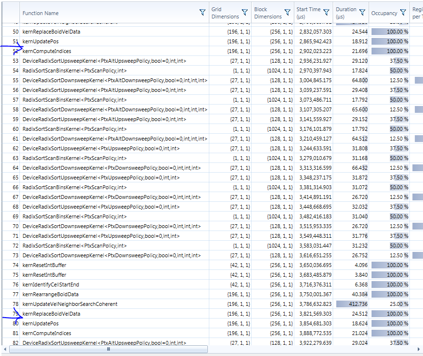
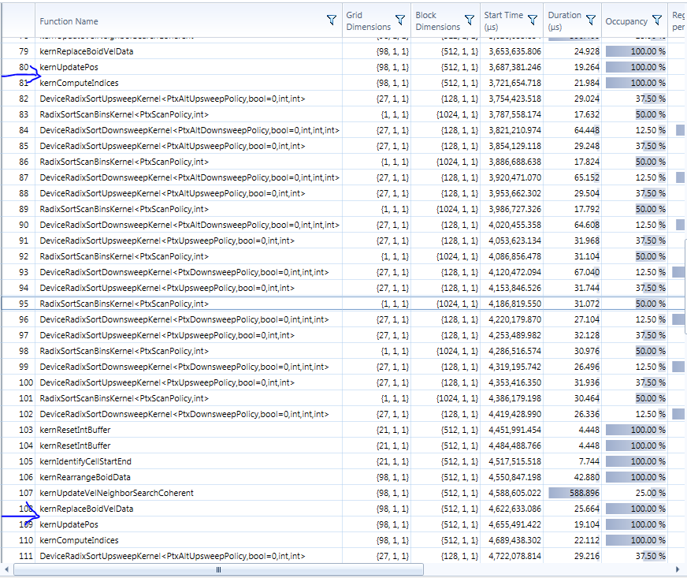

University of Pennsylvania, 
[CIS 565: GPU Programming and Architecture]
(http://www.seas.upenn.edu/~cis565/)

Implemented by [Gabriel Naghi]
(https://www.linkedin.com/in/gabriel-naghi-78ab4738) on 
Windows 7, Xeon E5-1630 @ 3.70GHz 32GB, GeForce GTX 1070 4095MB 
(MOR103-56 in SIG Lab)

Project 1 - Flocking
=====================

Over the course of this project, we implemented a flocking 
simulation. It is inteded to mimic roughly the behavior of 
groups of fish or birds- known throughout the code base as Boids.

There are 3 components to the flocking algorithm:
1. Boids gravitate toward the local center of gravity within a radius r1. 
2. Boids maintain a minimum disance r2 from their neighbors.
3. Boids attmpt to match the velocity of their neighbors within a radius r3.

We implemented three different methods of calculating the effects 
of these rules. The first, the naive implementation, checks, 
for each boid, every other boid and applies each of the rules 
if they are within the area of effect. The second implementation 
utilized a uniform grid which sorted the boid indices by the 
"sector" of the scene they occupied, and only checked the relevant 
adjacent cells for boids. The final implementation also udes a 
uniform grid, but removed one layer of indirection by resorting 
the data itself rather than saving a pointer to its original 
location, maximizing data coherence.

Perfomance Analysis
----------------------
My performance analysis was not done in an efficient manner. If 
I had to do this again, I would alter the program to take in 
command line args for the parameters (N_FOR_VIS and blockSize) 
and print time elapsed between events. I would then write a script 
to iterate though my test cases.

But alas, I did no do that and instead relied on the nsight 
performace analysis tools to take time readings. I didn't have 
a chance to sum up all the results, but the results are 
desplayed below.

Essentially, what we are trying to optimize here is the time it 
takes to prepare the new velocities for the updatePos kernel, 
which is standard accross implementaions. 
This is the time interval I am trying to show in the results below.

The metrics below clearly indicate that performace is inversely proportional to the number of boids. This is becuase as the number of boids rises, so does the population density. As a result, each boid will have that many more neighbors for which to calculate the three rules. Moreover, since each boid needs to calculate the effect of every other boid, the impact of increased boids is exponential. 

Implementing the coherent uniform grid definitely resulted in performace 
increase. This is the result we expected, since it cuts out a memory
access and instead uses a uniform addressing scheme. I found this a bit suprising, since we are still required to do a memory accces, albeit in 
the form of data relocation. Perhaps it has to do with a not needing to 
flush a data set out of cache. 

## Implementation vs Boid Count

###Naive Implementation
Fortunately, only one kernel call occurs between position updates
in the naive implementation. 

|# Boids| Time Elapsed |  
|-------|--------------|
| 500   |    1.2 ms    |
| 5000  |   11.2 ms    |
| 50000 | crashed CUDA | 

###Uniform Grid Implementation

500 Boids

5,000 Boids

50,000 Boids

500,000 Boids

5,000,000 Boids

###Coherent Grid Implementation

500 Boids
coherent

5,000 Boids

50,000 Boids

500,000 Boids

5,000,000 Boids

## Block Sizes

To test the effect of block size, I vairied block size by factors of 2, using only the 50,000 boid coherent implementation. I did this because I wanted to attempt to isolate the effects of block size. I realize that boid count is integral to the way the threads are eventually apportioned, and thus this data is incomplete, but this is what time allows. 

128 Threads per Block (same as coherent/50,000 above)

256 Threads per Block 

512 Threads per Block 

1024 Threads per Block - for reasons unknown, attmpting to lanch the 
program with blocksize of 1024 crashed the program at the point where it
would have done the coherent grid search. 

# Big Bugs

## Black Hole Boids

My coherent grid search had a bug where, instead of moving away from neighbors as per rule 2, it would gravitate toward them. This resulted in some boids clumping and as they moved around, would suck in any boids that came within their rule2Distance event Horizon.

## Boid out of Hell

Due to a faulty type delaration, boids which were being set with their own vlaues were getting high nigative values, most likely resulting from implicit float to int cast. This resulted in red boids zipping around on the top of the scene like embers above a fire. 
