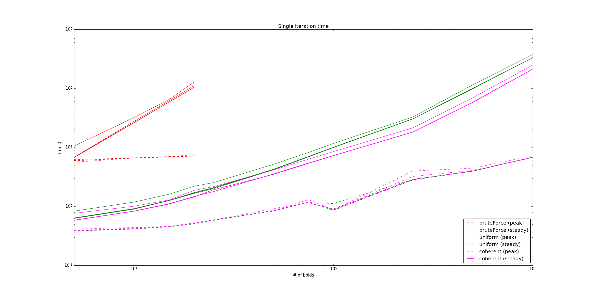
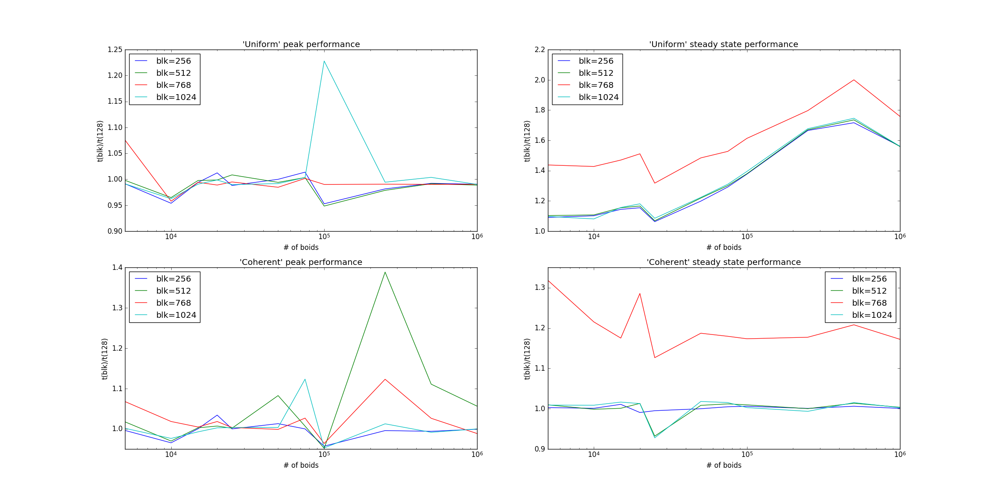
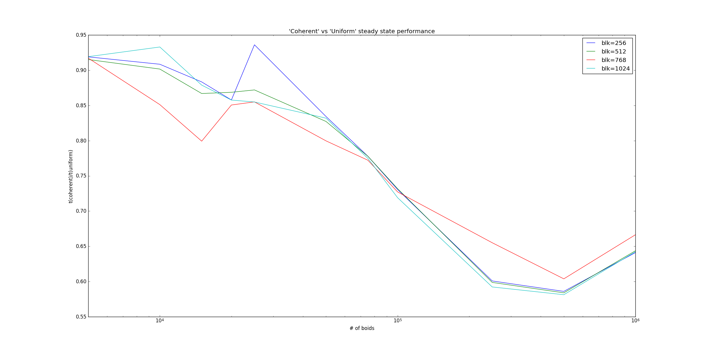

**University of Pennsylvania, CIS 565: GPU Programming and Architecture,
Project 1 - Flocking**

* Daniel Krupka
* Tested on: Debian testing (stretch), Intel(R) Core(TM) i7-4710HQ CPU @ 2.50GHz 8GB, GTX 850M

# Project 1 - Boids
This project's goal is to implement [Boids](https://en.wikipedia.org/wiki/Boids) using CUDA,
and to explore a few optimizations that can be made to the naive algorithm. To summarize,
the Boids algorithm implements flocking behavior as seen in birds as an emergent behavior
from a few simple rules. The algorithm is embarassingly parallel, as the behavior of each
Boid depends only on the previous state of the system. Details of the assignment can be found
 [here](INSTRUCTION.md).

# Optimization

The naive implementation checks every Boid. However, when the search space is large,
most Boids will not be nearby and have no effect. An effective solution to this is
to divide the search space with a grid whose cells are near the size of the Boid range
of influence, and only search neighboring grid cells. On a GPU, where data is most
effectively represented by arrays of values, this is performed by giving each Boid and grid cell an integer index,
and sorting the Boid indices by their corresponding grid cell index. Then, it is simple to find the slice of the Boid index array corresponding
to a given cell.

However, position and velocity are *not* sorted, requiring some index lookups to
find the spatial data for each boid. This is solved by shuffling the position and velocity arrays
to the same order as the Boid index array, making the data coherent and saving lookup time.

# Profiling

Optimizations were tested by running each implementation, referred to as 'brute force',
'uniform', and 'coherent', on Boid counts ranging from 5,000 to 1,000,000. Implementations
were also tested on CUDA block sizes ranging from 128 threads to 1,024 threads. Single-step
execution time was smoothed by an infinite horizon filter with alpha=0.95.

## Peak and Steady-State Rates

Preliminary probe runs showed that, in all implementations, simulation speed peaked early,
then settled into a steady state. This can be explained by noting that, as the simulation
progresses, the Boids 'clump', resulting in more Boids in a given Boids neighborhood than
there are in the dispersed initial state.

The plot of step time versus Boid count shows a weak influence of Boid count on peak rate, but
a strong influence on the steady-state, supporting the notion that cluster size is responsible
for speed degradation.

## Block Size

As the naive implementation failed at fairly low Boid counts, further testing
was performed only on the Uniform and Coherent methods.

The plot shows single step execution time of each block size, relative to a base
size of 128 threads. In both cases, higher block counts were no better, with substantial
degradation in the Uniform case. This is likely due to scattered memory accesses
rendering the GPUs limited caching ineffective. Additionally, both implementations
were substantially slowed by a 768 thread block, possibly due to the non-power-of-two
number of threads not mapping well to available hardware.

## Coherence

Direct comparison between the non-coherent and coherent implementations further
supports the importance of memory coherence, with the coherent version showing a
40% improvement in step time at large Boid counts.

