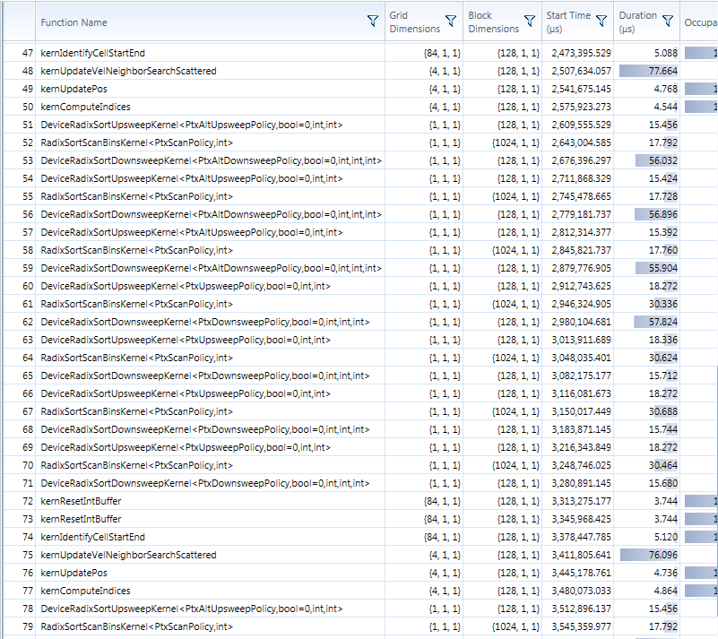
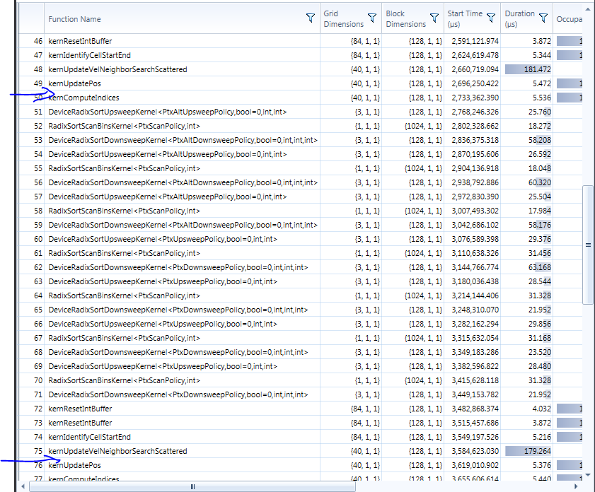
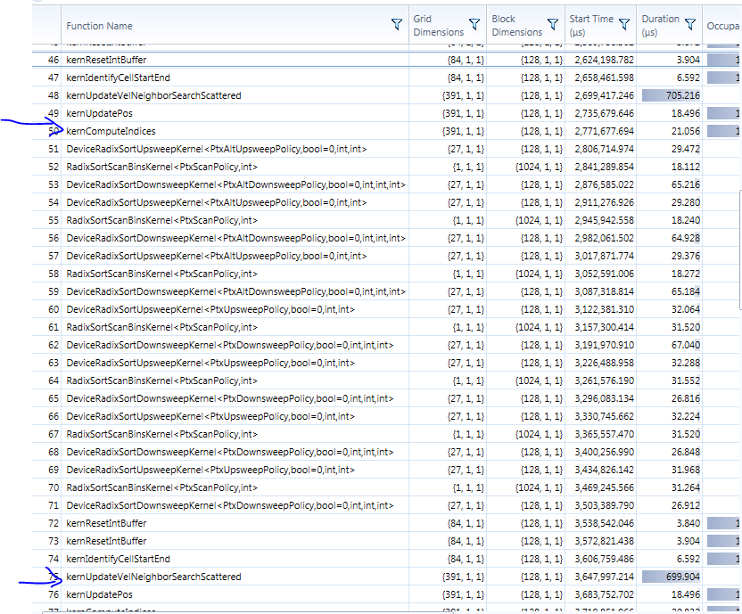
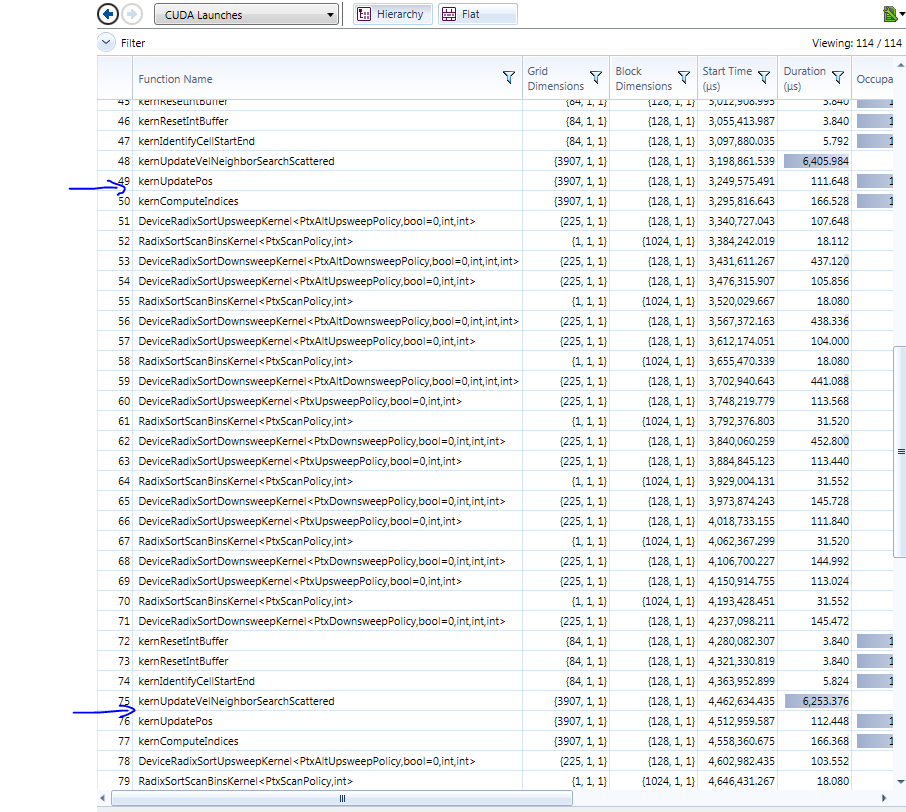
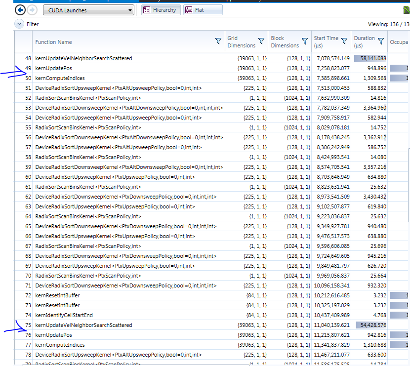
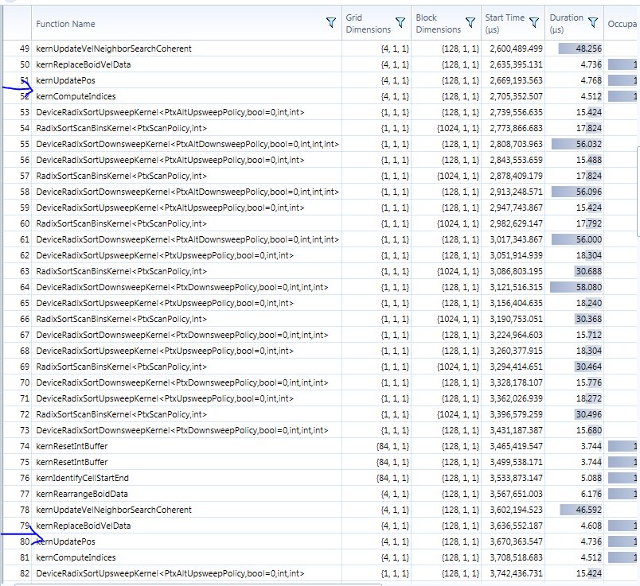
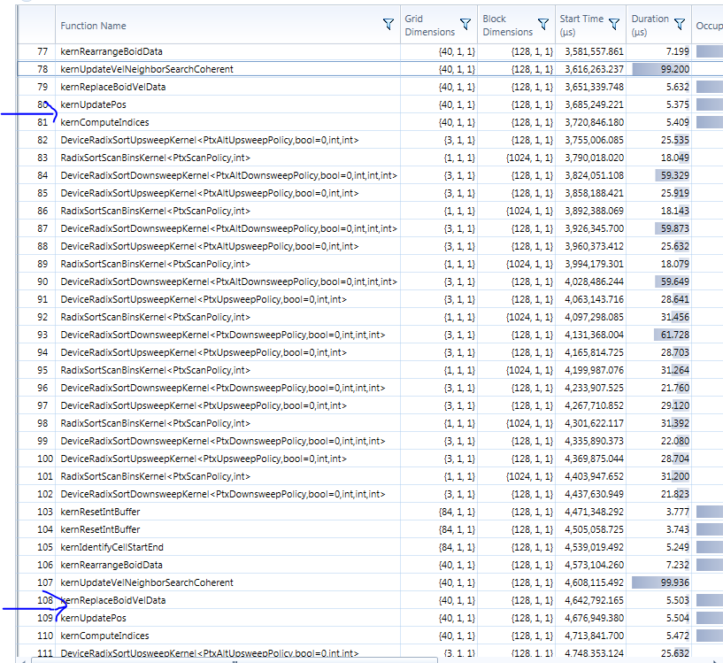
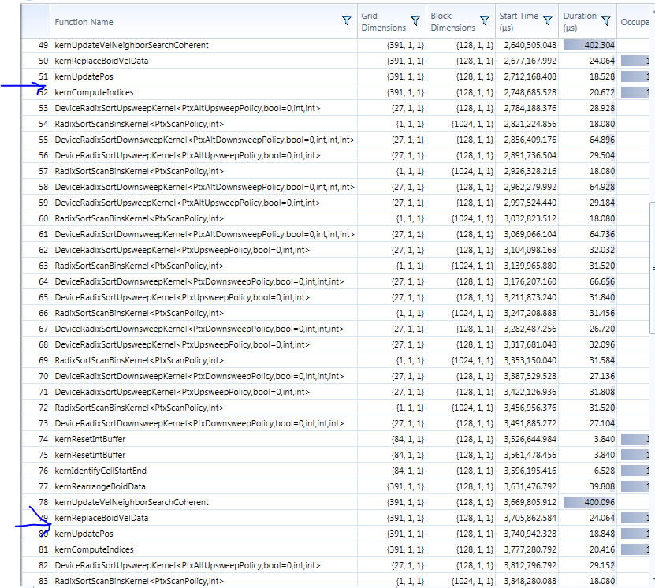
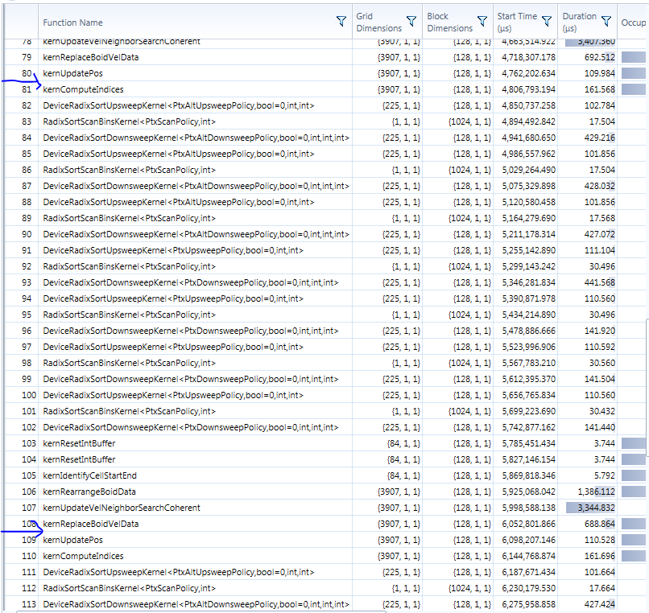
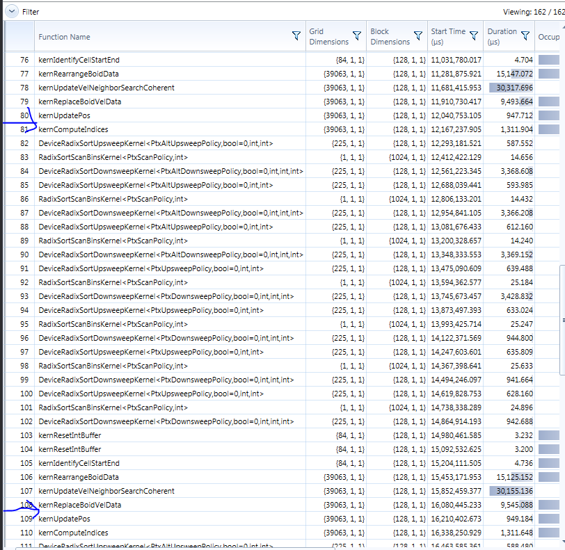

University of Pennsylvania, 
[CIS 565: GPU Programming and Architecture]
(http://www.seas.upenn.edu/~cis565/)

Implemented by [Gabriel Naghi]
(https://www.linkedin.com/in/gabriel-naghi-78ab4738) on 
Windows 7, Xeon E5-1630 @ 3.70GHz 32GB, GeForce GTX 1070 4095MB 
(MOR103-56 in SIG Lab)

Project 1 - Flocking
=====================

Perfomance Analysis
----------------------
My performance analysis was not done in an efficient manner. If 
I had to do this again, I would alter the program to take in 
command line args for the parameters (N_FOR_VIS and blockSize) 
and print time elapsed between events. I would then write a script 
to iterate though my test cases.

But alas, I did no do that and instead relied on the nsight 
performace analysis tools to take time readings. I didn't have 
a chance to sum up all the results, but the results are 
desplayed below.

Essentially, what we are trying to optimize here is the time it 
takes to prepare the new velocities for the updatePos kernel, 
which is standard accross implementaions. 
This is the time interval I am trying to show in the results below.

###Naive Implementation
Fortunately, only one kernel call occurs between position updates
in the naive implementation. 

|# Boids| Time Elapsed |  
|-------|--------------|
| 500   |    1.2 ms    |
| 5000  |   11.2 ms    |
| 50000 | crashed CUDA | 

###Uniform Grid Implementation

500 Boids

5,000 Boids

50,000 Boids

500,000 Boids

5,000,000 Boids

###Coherent Grid Implementation

500 Boids
coherent

5,000 Boids

50,000 Boids

500,000 Boids

5,000,000 Boids

