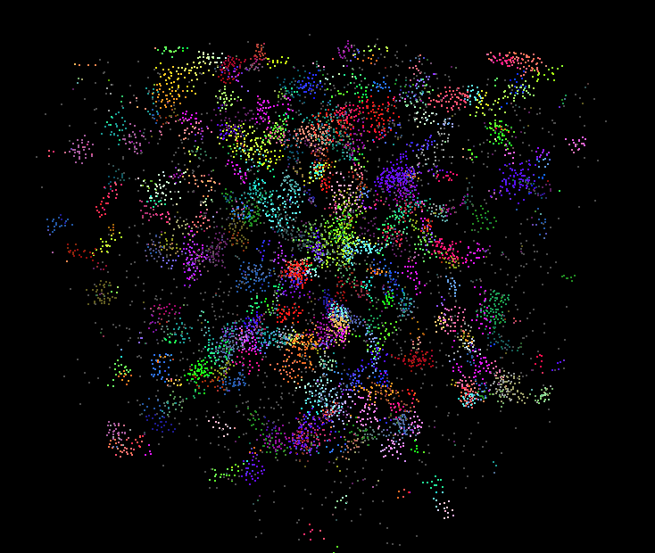

**University of Pennsylvania, CIS 565: GPU Programming and Architecture,
Project 1 - Flocking**

10000 particle simulation

500000 particle simulation

* Name: Zhan Xiong Chin
* Tested on: Windows 7 Professional, Intel(R) Xeon(R) CPU E5-1630 v4 @ 3.70 GHz 3.70 GHz, GTX 1070 8192MB (SIG Lab)

Build Instructions
==================
[See here](https://github.com/CIS565-Fall-2016/Project0-CUDA-Getting-Started/blob/master/INSTRUCTION.md)

Performance analysis
====================

|                        | 5000 particles | 50000 particles | 500000 particles |
|------------------------|----------------|-----------------|------------------|
| Naive search           | 60 fps         | 20 fps          | (crashes)        |
| Scattered uniform grid | 60 fps         | 60 fps          | 6 fps            |
| Coherent uniform grid  | 60 fps         | 60 fps          | 60 fps           |

The uniform grid is clearly much better than the naive search. Between the scattered and coherent uniform grids, the
scattered grid achieves 37.50% utilization in the main velocity update kernel, whereas the coherent grid achieves 50%
utilization.