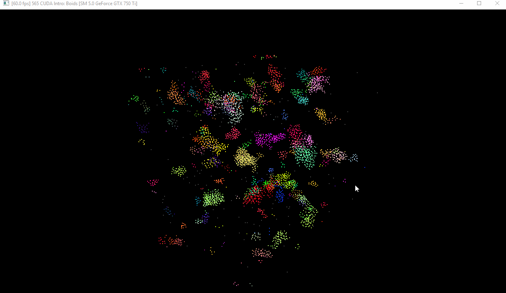

**University of Pennsylvania, CIS 565: GPU Programming and Architecture,
Project 1 - Flocking**

* Michael Willett
* Tested on: Windows 10, I5-4690k @ 3.50GHz 8.00GB, GTX 750-TI 2GB (Personal Computer)

# Contents
1. [Introduction](#introduction:-flocking-simulation)
2. [Naive Solution](#part-1:-naive-solution)
3. [Neighborhood Search](#part-2:-neighborhood-search)
4. [Build Instructions](#appendix:-build-instructions)

# Introduction: Flocking Simulation
This project explores introductory concepts of GPU paralization methods for simulating flocking behaviors
of simple particles known as boids. Boid motion is based off of three rules calculated from nearby particles:

1. *Cohesion* - Boids will move towards the center of mass of nearby boids
2. *Separation* - Boids will try to maintain a minimum distance from one another to avoid collision
3. *Alignment* - Boids in a group will try to align vector headings with those in the group

These simple rules with the appropriate tuning parameter set can lead to a surprisingly complex emergent 
behavior very similar to how schools of fish or flocks of birds move in nature, as seen below.

## Part 1 Naive Solution
The boids flocking simulation is naively calculated by comparing euclidean distance from the current
boid to every other boid in the simulation, and checking if the 

# Part 2: Neighborhood Search

# Appendix: Build Instructions