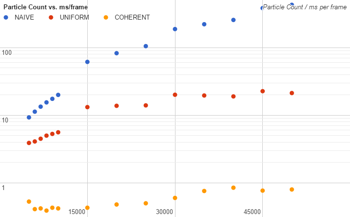
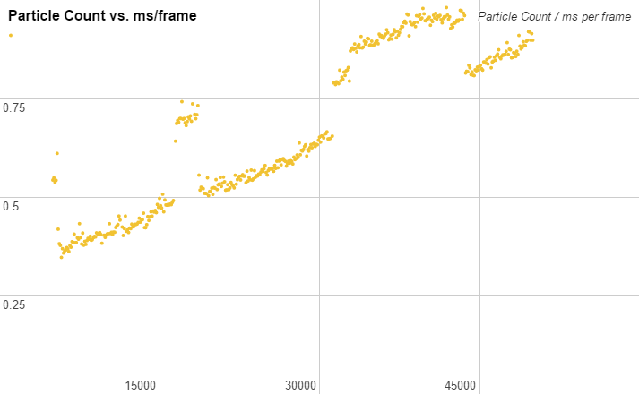
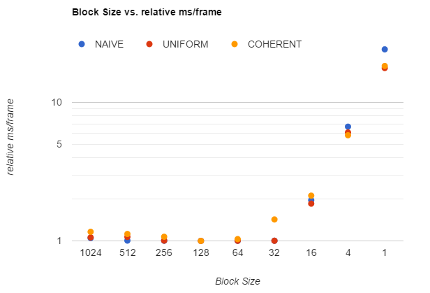

**University of Pennsylvania, CIS 565: GPU Programming and Architecture,
Project 1 - Flocking**

* Austin Eng
* Tested on: Windows 10, i7-4770K @ 3.50GHz 16GB, GTX 780 3072MB (Personal Computer)

# Flocking

Above is a simulation of 50,000 boids on the GPU using a uniform coherent grid to accelerate computation. Without visualization this runs at 850+ fps. Half a million agents can be simulated at 60+ fps.

# Performance Analysis

## Varying Boid Count
**Tests were done using a block size of 128. cudaTimer was used to measure the number of elapsed milliseconds to compute each frame. The average time for 1000 frames was recorded.** Command line arguments were added in the [profiling branch](https://github.com/austinEng/Project1-CUDA-Flocking/tree/profiling) to make it easier to run the program and vary boid count.

We can see that using uniform grids greatly improves performance and that adding coherence is even more performant. This makes sense because the uniform grid significantly reduces the number of boids that need to be checked against, and adding coherence makes memory access much faster. It's interesting to note, however, that the graphs of all three methods appear to be piecewise functions. They will increase exponentially at one rate (note the log scale) and then suddenly jump and increase at a different rate. Below is a graph with fine resolution exploring this phenomenon more deeply.

Note the large jumps at about (5300, 5500), (16400, 16500), (31200, 31300), and (43600, 43700). I think that this may be happening because in some situations, the number of boids does not map well to the underlying architecture and memory access becomes less efficient.

## Varying Block Size
**Tests were done using 5000 boids. cudaTimer was used to measure the number of elapsed milliseconds to compute each frame. The average time for 1000 frames was recorded.**

Note that the above graph shows the **relative** number of milliseconds per frame, that is, the ratio of elapsed time to the lowest elapsed time for that method. This is done in an effort the normalize the results to better compare how each method is affected by block size. They all show significant slowdowns beginning at a block size of 32 or less. This may be happening because at 32 or fewer threads per block, there is only one warp (group of 32 threads) in a block. These smaller blocks mean that we need a larger number of blocks. With every warp in its own block, we lose the performance benefits of shared memory within a block and instead need to allocate memory for each of our very many blocks.

Its worth noting that the coherent uniform grid saw these performance hits at a block size of 32 while the other methods were only impacted at 16. This may be because the coherent grid benefits more from shared memory access.

All methods also show slightly decreased performance as we increase the block size from 128 towards 1024 (max). Because the GPU I tested can have a maximum of 2048 active threads, this means that as we increase the block size, the number of blocks we can have decreases. At a size of 1024, there can only be two blocks. Threads in a block are organized in warps (groups of 32 threads) and only one warp can execute at a time. Therefore it seems that in an attempt to allow more threads to share the same memory by increasing block size, we've made the execution of the threads slightly more synchronous.
