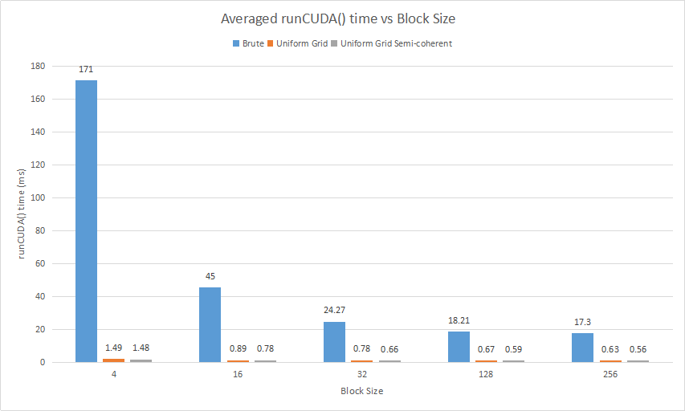

**University of Pennsylvania, CIS 565: GPU Programming and Architecture,
Project 1 - Flocking**

* Zimeng Yang
* Tested on: Windows 10, i7-4850 @ 2.3GHz 16GB, GT 750M (Personal Laptop)

## Simulation Overview 

Parameters for above simulation:

* Number of boids = `30000`, dT = `0.2`
* Resolution = `2560*1440`
* Coherent Uniform Grid
* BlockSize = `128`
* Scene Scale = `100`, MaxSpeed = `1.0`

||Distance|Scale|
|----|----|----|
|Rule 1: center of mass|5.0|0.01|
|Rule 2: separation|3.0|0.1|
|Rule 3: coherent|5.0|0.1|

## Performance Analysis

Parameters used in analysis remain the same as overview if not explicitly specified.

#### Methodology for Benchmark

All data (framerate and elapsed time) in the following performance analysis are collected by following two methodologies.

* First way is to make `#define VISUALIZE 0`, the framerate can be read from the window's title.
* Second way is to use `cudaEvent`, create two cudaEvents `start` and `stop` to record the elapsed time of function `runCUDA()`. Then average the elapsed time per **100** runnings, the result is used as averaged `runCUDA()` time. 

#### Framerate vs Number of Boids

The frametate of three different algorithms (`Brute Search`, `Uniform Grid` and `Coherent Uniform Grid`) vs number of boids:

#### Averaged runCUDA() Elapsed Time vs Number of Boids

Averaged runCUDA() time of `Uniform Grid` and `Coherent Uniform Grid` are compared vs number of boids:

#### Averaged runCUDA() Time vs Block Size  
Averaged runCUDA() time vs different block size:

## Answers to Questions 
* For each implementation, how does changing the number of boids affect performance?
	* As indicated in section **Framerate vs Number of Boids**, for Brute Search: framerate decreases significantly with the increase of number of boids. 
	* For Uniform Grid and Coherent Uniform Grid, they still remain interactive when number of boids reaches 100,000. But Coherent Uniform Grid has better performance than Uniform Grid. 

* For each implementation, how does changing the block count and block size affect performance?
	* For each implementation, if block size is pretty small (like 4 or less), the performance will be devastated. With the increase of block size , the performance will be improved too. But with the increase of block size, the improvement of performance will be less obvious. So I think this is a trade-off, the key is how to choose a block size number that is not too low to share memory for different threads. But much higher block size is not necessary. Too small block size will make the hit-rate of shared-memory within a GPU block pretty small, which will introduce frequent memory operations and reduce the performance. 

* For the coherent uniform grid: did you experience any performance improvements with the more coherent uniform grid? Was this the outcome you expected?
	* Yes. According to **Averaged runCUDA() Elapsed Time vs Number of Boids**, Coherent Uniform Grid **did** perform better than basic Uniform Grid implementation, which was the same as I expected. After re-shuffling the `pos` and `vel` arrays of particle, the data will be more consistant and continuous in memory. "Consistant and continuous" means that physically adjacent threads (continuous thread indices) on GPU will be likely to access the same location of memory since they are likely to locate in the same grid cell. And the informations of boids in the same grid cell are re-shuffled to make them continuous in memory, so there will be performance improvement for Coherent Uniform Grid. Performance will be improved from more continuous data structure in memory on GPU, which will increase the memory hit-rate within a block size where the threads are physically adjacent.

	
