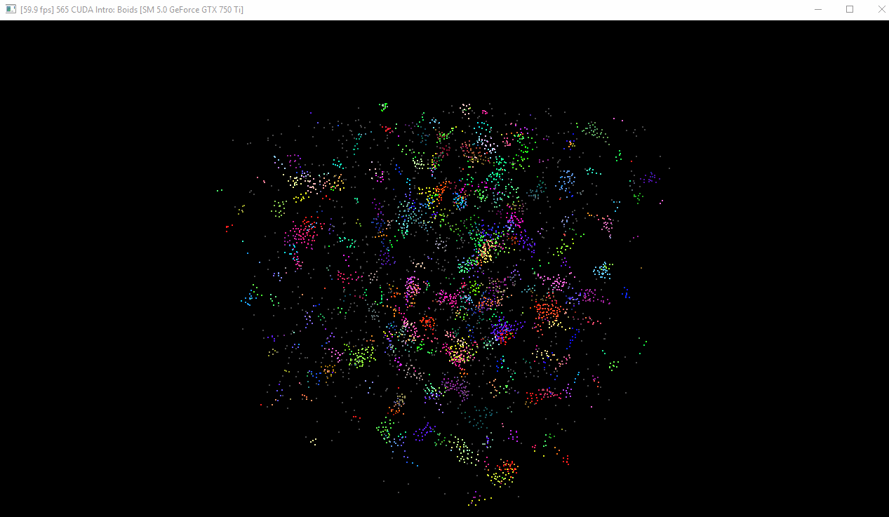

**University of Pennsylvania, CIS 565: GPU Programming and Architecture,
Project 1 - Flocking**

* Michael Willett
* Tested on: Windows 10, I5-4690k @ 3.50GHz 8.00GB, GTX 750-TI 2GB (Personal Computer)

# Contents
1. [Introduction](#intro)
2. [Naive Solution](#part1)
3. [Neighborhood Search](#part-2)
4. [Build Instructions](#appendix)

<a name="intro"/>
## Introduction: Flocking Simulation
This project explores introductory concepts of GPU paralization methods for simulating flocking behaviors
of simple particles known as boids. Boid motion is based off of three rules calculated from nearby particles:

1. *Cohesion* - Boids will move towards the center of mass of nearby boids
2. *Separation* - Boids will try to maintain a minimum distance from one another to avoid collision
3. *Alignment* - Boids in a group will try to align vector headings with those in the group

These simple rules with the appropriate tuning parameter set can lead to a surprisingly complex emergent 
behavior very similar to how schools of fish or flocks of birds move in nature, as seen below.

<a name="part1"/>
## Part 1 Naive Solution
The boids flocking simulation is naively calculated by comparing euclidean distance from the current
boid to every other boid in the simulation, and checking if the distance is within the desired range for
the rule being calculated (we use a smaller distance metric for calculating separation, otherwise the boids
never exhibit flocking behavior).

<a name="part2"/>
## Part 2: Neighborhood Search

<a name="appendix"/>
## Appendix: Build Instructions

* `src/` contains the source code.
* `external/` contains the binaries and headers for GLEW and GLFW.

**CMake note:** Do not change any build settings or add any files to your
project directly (in Visual Studio, Nsight, etc.) Instead, edit the
`src/CMakeLists.txt` file. Any files you add must be added here. If you edit it,
just rebuild your VS/Nsight project to make it update itself.

#### Windows

1. In Git Bash, navigate to your cloned project directory.
2. Create a `build` directory: `mkdir build`
   * (This "out-of-source" build makes it easy to delete the `build` directory
     and try again if something goes wrong with the configuration.)
3. Navigate into that directory: `cd build`
4. Open the CMake GUI to configure the project:
   * `cmake-gui ..` or `"C:\Program Files (x86)\cmake\bin\cmake-gui.exe" ..`
     * Don't forget the `..` part!
   * Make sure that the "Source" directory is like
     `.../Project1-CUDA-Flocking`.
   * Click *Configure*.  Select your version of Visual Studio, Win64.
     (**NOTE:** you must use Win64, as we don't provide libraries for Win32.)
   * If you see an error like `CUDA_SDK_ROOT_DIR-NOTFOUND`,
     set `CUDA_SDK_ROOT_DIR` to your CUDA install path. This will be something
     like: `C:/Program Files/NVIDIA GPU Computing Toolkit/CUDA/v7.5`
   * Click *Generate*.
5. If generation was successful, there should now be a Visual Studio solution
   (`.sln`) file in the `build` directory that you just created. Open this.
   (from the command line: `explorer *.sln`)
6. Build. (Note that there are Debug and Release configuration options.)
7. Run. Make sure you run the `cis565_` target (not `ALL_BUILD`) by
   right-clicking it and selecting "Set as StartUp Project".
   * If you have switchable graphics (NVIDIA Optimus), you may need to force
     your program to run with only the NVIDIA card. In NVIDIA Control Panel,
     under "Manage 3D Settings," set "Multi-display/Mixed GPU acceleration"
     to "Single display performance mode".

#### OS X & Linux

It is recommended that you use Nsight.

1. Open Nsight. Set the workspace to the one *containing* your cloned repo.
2. *File->Import...->General->Existing Projects Into Workspace*.
   * Select the Project 0 repository as the *root directory*.
3. Select the *cis565-* project in the Project Explorer. From the *Project*
   menu, select *Build All*.
   * For later use, note that you can select various Debug and Release build
     configurations under *Project->Build Configurations->Set Active...*.
4. If you see an error like `CUDA_SDK_ROOT_DIR-NOTFOUND`:
   * In a terminal, navigate to the build directory, then run: `cmake-gui ..`
   * Set `CUDA_SDK_ROOT_DIR` to your CUDA install path.
     This will be something like: `/usr/local/cuda`
   * Click *Configure*, then *Generate*.
5. Right click and *Refresh* the project.
6. From the *Run* menu, *Run*. Select "Local C/C++ Application" and the
   `cis565_` binary.
