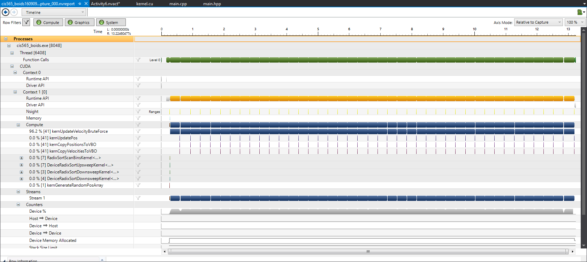

**University of Pennsylvania, CIS 565: GPU Programming and Architecture,
Project 1 - Flocking**

* Rony Edde
* Tested on: Personal Laptop Windows 22, i7-6700k @ 4.00GHz 64GB, GTX 980M 8192MB (home)

### (TODO: Your README)

Include screenshots, analysis, etc. (Remember, this is public, so don't put
anything here that you don't want to share with the world.)

**Title changes and performance analysis**

Boids simulation running 3 implementation versions.

* The Naive method consists of a neighbor search through all boids
  This is slow due to the large lookup.

* The sparse grid lookup where all boids are indexed using a voxel
  grid to identify nearby cells.  This is much faster because we
  only search boids that are in neighboring cells.

* The coherent grid where instead of indexing the particle pointers
  in order to find their corresponding velocity and positions, we
  sort the position and velocity attributes directly.

* Performance
  The naive solution seems fast enough with 5000 points running on
  a GTX980M but increasing this to 10000 and we see a drop by half
  the framerate and exponentially slower the higher the number.

  * here are a few CUDA compute average results on 5000 points:
    * Naive:
        Average CUDA frame time 3.584352 ms
        Average CUDA frame time 3.646981 ms
        Average CUDA frame time 3.643696 ms
    * Saprse Grid:
        Average CUDA frame time 1.676956 ms
        Average CUDA frame time 2.982781 ms
        Average CUDA frame time 3.228212 ms
    * Coherent Grid:
        Average CUDA frame time 1.936160 ms
        Average CUDA frame time 1.930368 ms
        Average CUDA frame time 2.040167 ms
    
    The performance is a bit faster with the sparse and coherent
    solutions and it looks like the coherent solution is a litte
    faster but overall not much difference can be seen with 5000
    points.
    
    * Pushing the limit further reveals more.  Here are the
      results when simulating 100,000 points:
    * Naive:
        Average CUDA frame time 2190.682983 ms
        Average CUDA frame time 2174.661621 ms
        Average CUDA frame time 2174.265381 ms
    * Saprse Grid:
        Average CUDA frame time 16.067091 ms
        Average CUDA frame time 22.827206 ms
        Average CUDA frame time 27.569127 ms
    * Coherent Grid:
        Average CUDA frame time 18.013756 ms
        Average CUDA frame time 21.239281 ms
        Average CUDA frame time 21.476675 ms

    Here we can clearly see the advantage of using grids.
    Especially the coherent solution which reduces index lookup.

Here are a few performance analysis with NSIGHT:
    * Bruteforce:

    * Sparce Grid:

    * Coherent Grid:

