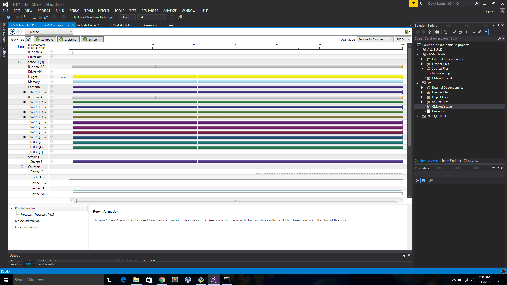

**University of Pennsylvania, CIS 565: GPU Programming and Architecture,
Project 1 - Flocking**

* Akshay Shah
* Tested on: Windows 10, i7-5700HQ @ 2.70GHz 16GB, GTX 970M 6GB (Personal Computer)

### Screenshots

Here is an implementation of the coherent grid boid simulation with 5000 and 120,000 boids respectively:

5000 boids

120,000 boids

### Analysis

* For each implementation, how does changing the number of boids affect performance? Why do you think this is?

 A: Increasing the boids decreases the FPS as there are more boids to look at to include them to change the velocity.
 Here is an image comparing the different implementations with increasing number of boids:

 

* For each implementation, how does changing the block count and block size affect performance? Why do you think this is?

  A: Increasing the blocksize slightly increases the FPS over time over the same number of boids. This is maybe due to many blocks per function call
  

* For the coherent uniform grid: did you experience any performance improvements with the more coherent uniform grid? Was this the outcome you expected? Why or why not?

  A: The average FPS for coherent grid was slower over lesser number of boids but stays at a stable rate of 45fps for 80,000 boids whereas the uniform grid reduces down over time to 30fps for the same number of boids. Look at the following graph for an example:

  

  Following is an analysis of the average time spent in a function:
  
  Notice how the average time spent is 94% in updating velocities.
  This is a naive implementation of the simulation.

  
  Notice the average time spent in the update velocity is 20% and is staggered over the update position and compute start and end cell grid indices. 
